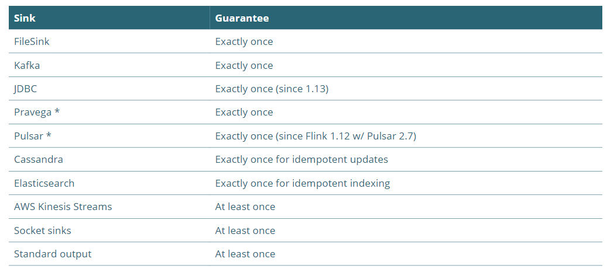

# 2.2.4 连接流

* 连接两个流以一起处理它们
* 已连接流可以共享状态
* 因为两个流共享state是keyed，所以两个keyedStream必须基于同一个key。如果一个stream的key是user\_id，另外一个的key是account\_id，则没有意义。

场景举例：假设我们有一个上游系统流动态（control stream）的告诉我们哪些值是需要从数据流（data stream）中过滤掉的。



```java
public class StreamingJob {
    public static void main(String[] args) throws Exception {
        StreamExecutionEnvironment env = StreamExecutionEnvironment.getExecutionEnvironment();
        
        DataStream<String> control = env.fromElements("DROP", "IGNORE").keyBy(x -> x);
        DataStream<String> data = env
            .fromElements("Flink", "DROP", "Forward", "IGNORE")
            .keyBy(x -> x);
        
        control
            .connect(data)
            .flatMap(new ControlFunction())
            .print();
        
        env.execute();
    }

```

注意，我们两个流都被keyed by 流记录本身，一个String。我们将这两个流关联起来，并且应用一个ControlFunction。

```javascript
public static class ControlFunction extends RichCoFlatMapFunction<String, String, String> {
  private ValueState<Boolean> blocked;
    
  @Override
  public void open(Configuration config) {
    blocked = getRuntimeContext().getState(new ValueStateDescriptor<>("blocked", Boolean.class));
  }

  @Override
  public void flatMap1(String controlValue, Collector<String> out) throws Exception {
    blocked.update(Boolean.TRUE);
  }
    
  @Override
  public void flatMap2(String dataValue, Collector<String> out) throws Exception {
    if (blocked.value() == null) {
      out.collect(dataValue);
    }
  }
}
```

主要ControlFunction是对RichCoFlatMapFunction的扩展。Rich表示涉及state访问, Co表示这个function被应用到关联流本身。我们需要实现的是两个flatMap函数，分别对应两个需要关联的stream的event到达的处理。

当接收到控制流的事件，即我们应该过滤的单词时，我们只存储一个boolean flag到ValueState。两个流keyed by同一个key，即单词本身。这保证了当这个词到达data stream时，我们将访问这个相同的flag并且只通过没有被阻塞/过滤的词。

Attention

重要提示：这两个流可以相互竞争。因为这两个流中元素处理的时间是无法严格控制的。稍后将讨论 Flink 提供的一些机制，主要是保障处理顺序的确定性。

## join vs connect vs coGroup vs union <a href="#mozgf" id="mozgf"></a>


