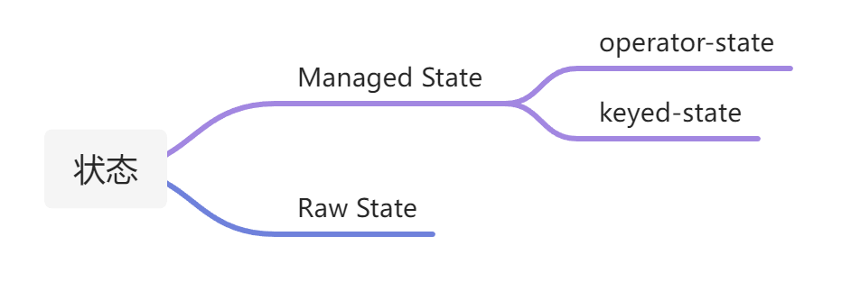

# 2.2 Flink状态的基础

## 状态、状态管理的基本概念

1. _**状态：**_指 Flink 程序中的状态数据，博主认为也能代指用户在使用 DataStream API 编写程序来操作 State 的接口。你在 Flink 中见到的 ValueState、MapState 等就是指状态接口。你可以通过 MapState.put(key, value) 去往 MapState 中存储数据，MapState.get(key) 去获取数据。这也是你能直接接触、操作状态的一层。
2. _**状态后端：**_做状态数据（持久化，restore）的工具就叫做状态后端。比如你在 Flink 中见到的 RocksDB、FileSystem 的概念就是指状态后端。这些状态后端就是实际存储上面的状态数据的。比如配置了 RocksDB 作为状态后端，MapState 的数据就会存储在 RocksDB 中。再引申一下，大家也可以理解为：应用中有一份状态数据，把这份状态数据存储到 MySQL 中，这个 MySQL 就能叫做状态后端。
3. _**状态管理（Checkpoint、Savepoint）：**_协调整个任务 when，how 去将 Flink 任务本地机器中存储在状态后端的状态去同步到远程文件存储系统（比如 HDFS）的过程就叫 Checkpoint、Savepoint。

## 状态分类

我们在生产上基本只会用到 Managed State（托管状态），不会用到 Raw State（原生状态）。下面仅介绍Managed State。

### 托管状态

* 本地、快速：在内存里或本地磁盘上
* 持久化：checkpoints机制
* 垂直可扩展：RocksDB
* 水平可扩展（可重复可分配）：keyspace是按照集群来分片的
* 可查询：可查询的state API

举个简单的例子：想在处理每个用户第一次事件消息时，做一些特别的事情。这显然需要一些状态。首先想到的可能是可以把这个状态保存在一个局部变量中。

但是我们在这里处理的是分布式系统，随着系统的扩展，出现故障的可能性越来越大。 但是即使你假设你的应用程序永远不会失败，那么重新部署呢？ 我们仍然需要一些方法来进行快照和恢复状态。

此外，在集群中，每个节点需要为在该节点上处理的users维护一个状态的key/value的map。当集群扩容或缩容时，也需要通过某种方式来重新分布状态。

## 分布式有状态流处理 

* 所有 DataStream 函数都可以是有状态的，filter, map, flatMap, etc
* 对于keyed streams，计算和状态通过相同的key进行分区
* 所有状态是本地化的
* 状态可以是基于堆内内存的，也可以是堆外内存，本地磁盘支持的存储中。

 (2).png>)

在上一节介绍keyBy的时候，贴过这张图。keyBy 与有状态的流处理一起工作。 例如，想要实现第一次看到新用户时，触发特殊操作的场景。

只有当我们保证每个特定用户的所有event都由同一个算子来处理，我们才能实现这个功能。即：

* 一个用户的所有数据均由同一个单节点来处理
* state 只能在定义它的函数/算子中访问

### Rich Functions 

Flink中所有使用状态的函数(业务逻辑)都必须扩展（extends）Rich\*\*Fcunction。

前面我们介绍了一些基础functional interfaces，比如filter, map, flatMap。它们的特点是：

* 单个抽象方法(SAM)
* 支持Java8 lambda表达式

这些函数接口都有一些变形，叫做rich functions。这些rich functions可以支持状态服务。例如e.g., RichFlatMapFunction。Rich Function有一些固定的函数，我们会在代码实现中用到

* open()
* close()
* getRuntimeContext()

### Runtime context 

问题：Flink的状态我们知道是本地化存储的，那么我们怎么访问这些存储在本地的托管状态呢？

运行时上下文是访问有关作业运行环境的各种有趣信息的门户。当下，我们聚焦于它让我们能够访问状态后端（state backend），这是 Flink 托管状态的存储位置。

Runtime context

* getIndexOfThisSubtask()
* getNumberOfParallelSubtasks()
* getExecutionConfig()

通过getState()方法来访问key-partitioned state。
