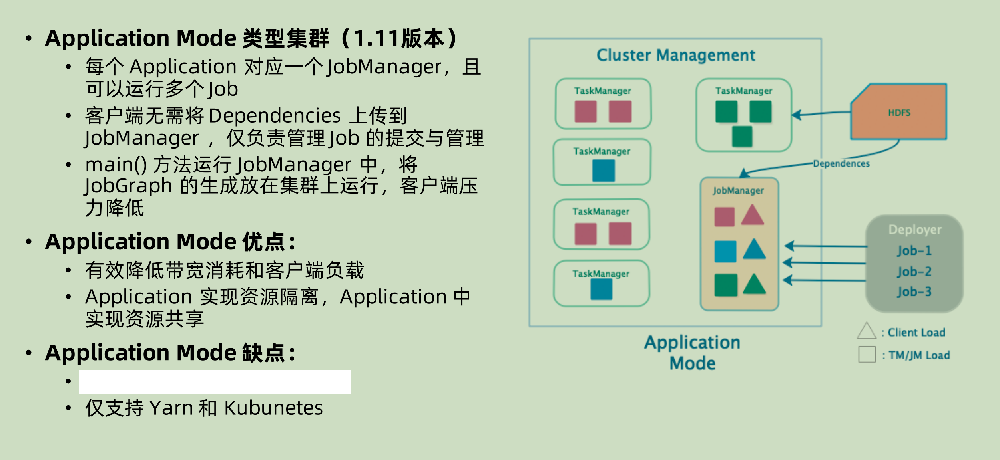

# Flink部署模式

集群的部署模式，主要是以下两种条件来将其分成三种类型：

1. 集群的生命周期和资源隔离：
   1. 生命周期：也就是整个 Runtime 是否随着 job 的结束而销毁
   2. 资源隔离：多个 job 共享一个 jobManager 还是为每一个 job 提供一个 jobManager
2. 根据程序的main()方法是在 client 上面执行还是在 jobManager 上面执行：
   1. 在 client 上面：由 client 来生成 jobGraph，并且传到 JobManager 上面去
   2. 在 jobManager上面：application mode，整个 application 的 main()在 cluster 上面运行，jar 包可以放在比如 hadoop 的地方

## Session 集群模式

session 集群模式之中，整个 flink cluster 只有一个 JobManager，所有的 job 都先由对应的 client 进行解析生成 JobGraph 之后，和相关的depandency jar 一起再去提交到 JobManager 上面。整个 JobManager 不会受到不同的 Job 周期的影响。

注意其中的每一个 TaskManager 可以**有不同的 job 在运行**

**优点：**

1. 运行的 taskManager 本身的资源是充分共享的，资源利用率可以提高
2. Job 的管理是在 session 集群之中的，运维相对来说不是在resource management，比如 yarn 那边，所以更简单一些。

**缺点：**

1. 既然共享，就会有资源隔离相对比较差的问题。
2. 如果在非 native 模式下面进行部署，会在部署的时候就已经将 taskManager 固定好了，无法再进行资源的扩展。但是如果是native 模式下面进行部署，那么就没有这个问题。

## Per-job 运行模式

Per-job 模式下面就是对于每一个job，都临时创建 jobManager，启动 taskManager 和生成对应的 runtime。

**优点：**

既然彼此隔离，那么对于每个 job 的灵活度就更高，比如其中的 taskManager 之中的 slot 个数就可以随着 job 本身来进行定义。相对之下，就是 job 之间彼此的资源隔离非常充分。

**缺点：**

1. JobManager 本身也需要消耗资源，为每一个 job 单独启动一个 JobManager，很大概率上面资源会被浪费。
2. 彼此隔离，就只能将管理交给 Cluster Management。相对就会提高管理的难度。

## Application mode

### 为什么要将 Jar 的解析从 client 转到 cluster？

Session 和 per-job 模式下面，都是先将对应的 jar 在 client 进行解析，然后提交到 JobManager 上面。

生成 JobGraph 的过程很消耗 CPU 资源，而且在多个 JAR 进行排队提交的时候，有可能会造成 blocking（排队等待解析和上传 dependency JAR）。dependency jar 也可能很大，造成 cluster 和 client 之间的网络堵塞。所以就有一种想法——为什么不把这些交给 JobManager？

### Application mode

在这个 mode 下面，client 只是负责命令和接收结果，从解析过程开始之后就是放在 JobManager 上面运行。可以自己去指定划分 application，每一个 application 之中都有很多 job。dependency jar 可以由 jobManager 上传到 hdfs（yarn mode），或者是打包镜像（k8s mode)。


与per-job 模式相比，Application 模式允许提交由多个Job组成的应用程序。Job执行的顺序不受部署模式的影响，但受启动Job的调用的影响。使用阻塞的 `execute()`方法，将是一个顺序执行的效果，结果就是"下一个"Job的执行被推迟到“该”Job完成为止。相反，一旦提交当前作业，非阻塞`executeAsync()`方法将立即继续提交“下一个”Job。

目前Flink是允许在一个user jar的main里面，运行多次execute的，包括executeAsyc。 每执行一次execute，就是提交了一个任务（job）。所以你是可以这样来实现一个Application里面 运行多个job。但这里需要注意的是，目前只有非HA的Application模式可以支持多job HA模式还不行，具体原因主要是恢复起来会很麻烦，还没有实现。21年。

重要：job与executue()方法对应。


生产可用的资源管理器一般是基于Yarn和K8S两种模式。
